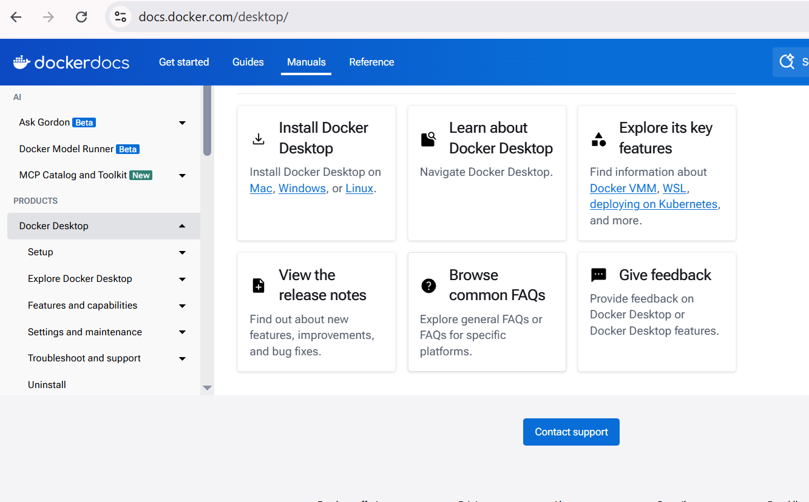

## Docker - Install

### Windows

https://docs.docker.com/desktop/setup/install/windows-install/


### Linux
#### Ubuntu

- https://docs.docker.com/desktop/setup/install/linux/ubuntu/

```bash
# Add Docker's official GPG key:
 sudo apt-get update
 sudo apt-get install ./docker-desktop-amd64.deb
 systemctl --user start docker-desktop
```
#### RHEL
- https://docs.docker.com/desktop/setup/install/linux/rhel/
````bash
sudo subscription-manager repos --enable codeready-builder-for-rhel-9-$(arch)-rpms
sudo dnf install https://dl.fedoraproject.org/pub/epel/epel-release-latest-9.noarch.rpm
sudo dnf install pass
````


	
