# Example

Let's say you want to develop a website and you need PHP, MySQL and PhpMyAdmin on your machine, this feature is free in Docker-Compose and does not access any server. If the website is successful, you can hire a plan and use the SaaS of a server that has these resources, in addition to 24-hour support, if you are a beginner developer and use SaaS because your company thought it was a good alternative.

If you choose a server, compare prices

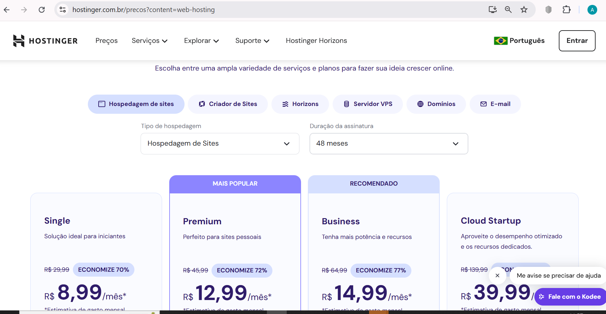
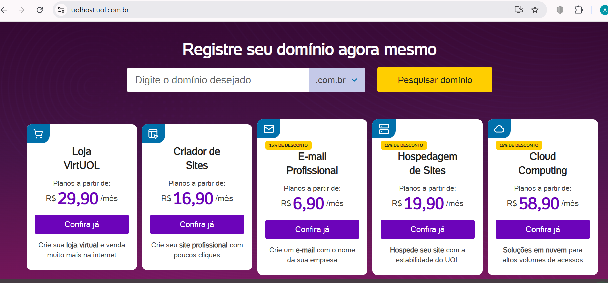
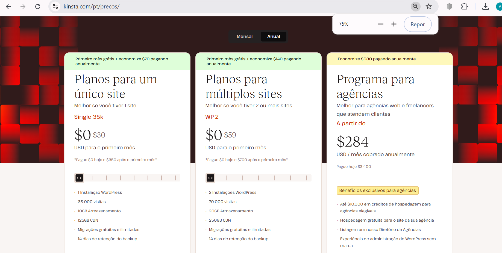

Cpanel is integrated with them, if you are a developer, you will be able to see all the things that your developer access allows, the administrator (or tech-lead) is the one who releases the privileges, these servers are different from AWS | GOOGLE | AZURE, but they are very important and are also widely used by companies, due to numerous advantages and facilities. The choice of Cloud is made based on meetings and calculations, each place chooses the one that best corresponds to its business needs.

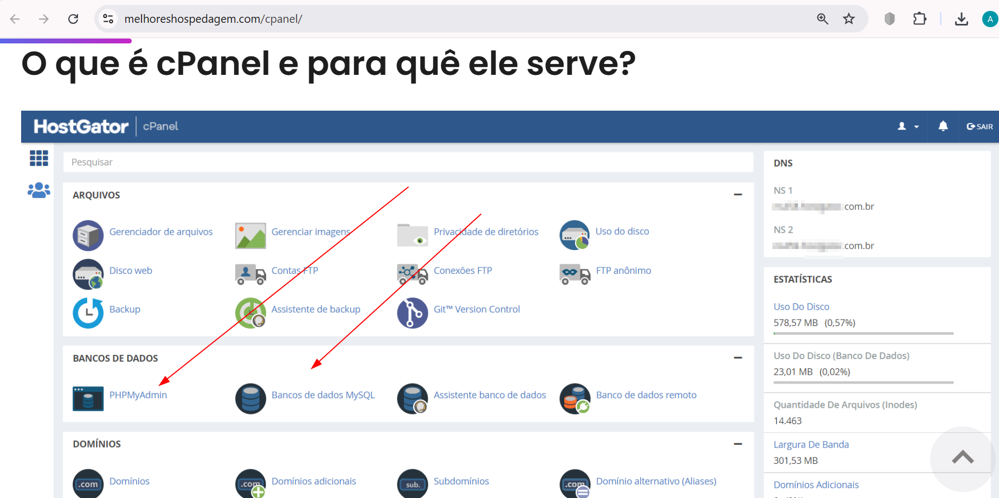

- https://kinsta.com/pt/

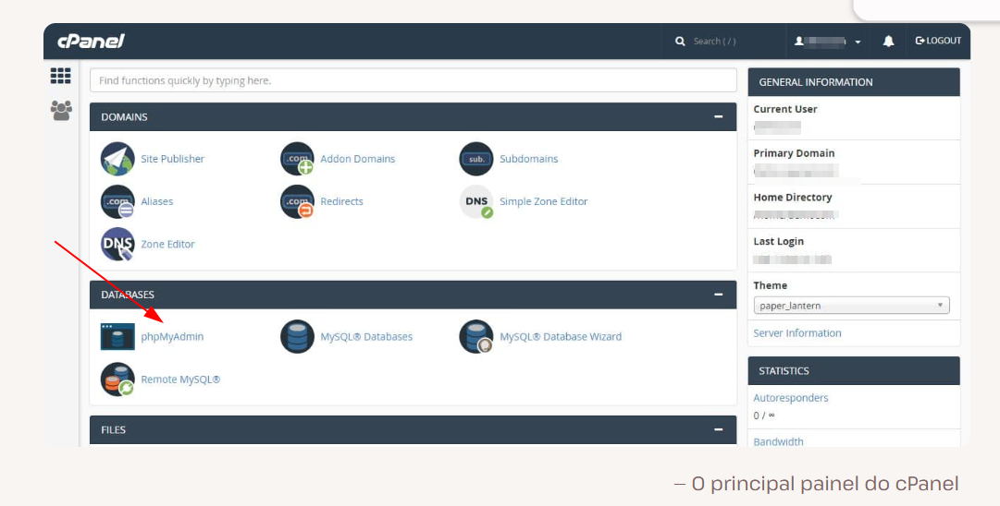

- https://support.cpanel.net/hc/en-us/community/posts/19148254614167-Highly-scalable-cPanel-installation-SaaS-software-product

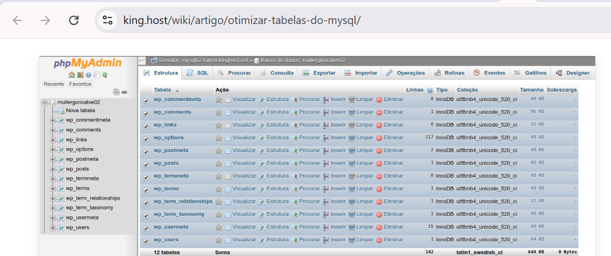

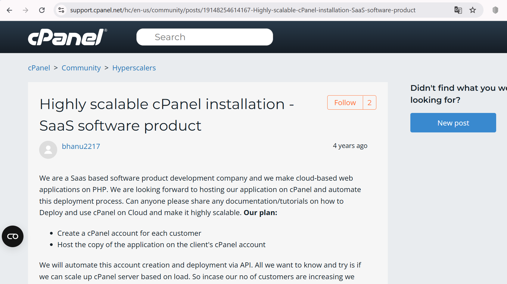

## Run PHP Image - Example in local environment

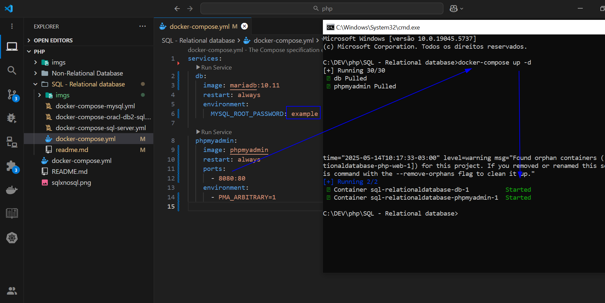
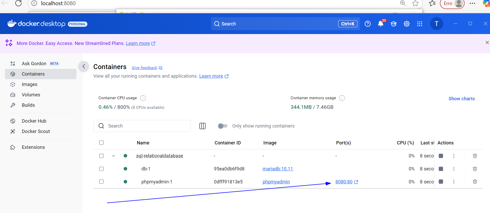
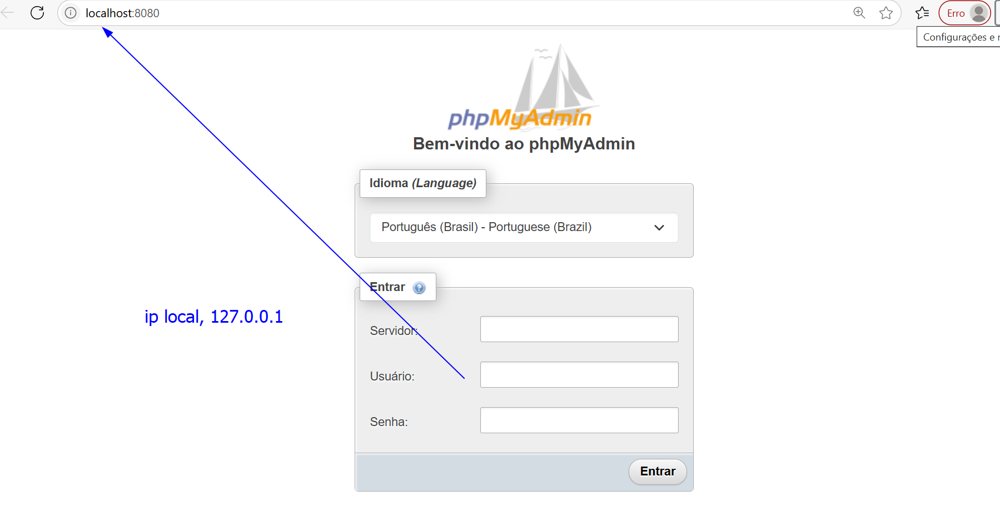
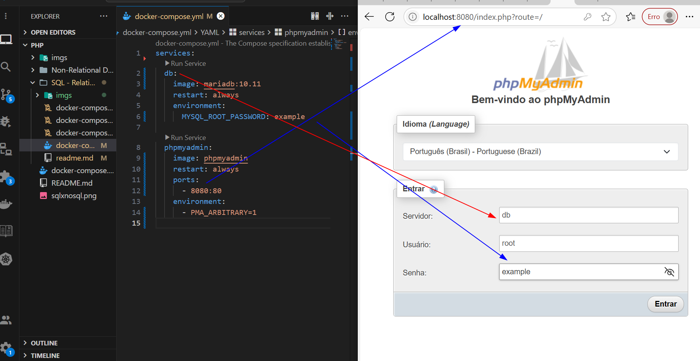
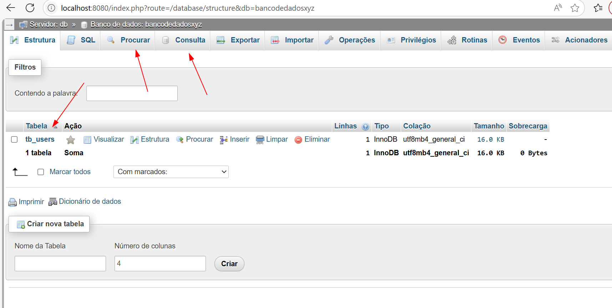

> [!NOTE]
>
> Technical (and local) context 